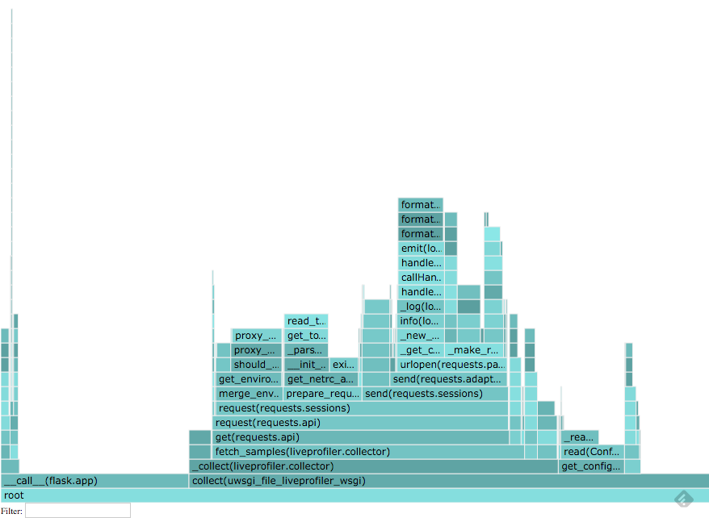

[](https://circleci.com/gh/fieldaware/liveprofiler)
[](https://badge.fury.io/py/liveprofiler)

# Liveprofiler visualizer and collector

This is a service that collects and presents samples generated by [livepofier_sampler](https://github.com/fieldaware/liveprofiler_sampler).
It is fallow up work based on https://github.com/nylas/nylas-perftools. So most of the credit goes to: nylas.com

To really understand what is going on here check this great blog post: https://www.nylas.com/blog/performance

# Overview

```
                                                      web client
service one<----------------+                           +
                            |                           |
                            +                           v
service two<-----------+collector+--------+         visualizer
                            +             |             ^
                            |             v             |
service three<--------------+          database+--------+

```

* each service runs liveprofiler_sampler middleware
* collector pulls metrics from services and saves them to python dbm database
* visualizer reads dbm database and plots the results per host

# Collector

Collector is responsible for gathering samples for configured hosts. Because sampler is protected with secret header, it has to be configured in collector as well. Collector should be called periodically (every few seconds). If you are planning to run collector with uWSGI (recommended) see running with uWSGI section. If not, you can set up cron to call `collector/` endpoint. It will return number of collected samples from all hosts.

```
[collector]
secret_header = {SECRET HEADER}
hosts= {LIST OF HOSTS SEPARATED BY COMMA (host1,host2,host3)}
```

# Visualizer

Uses flame graph to plot stacks and their counts.



# Example

If you provide sampler configuration you can plot samples for the visualizer itself - it is a nice self-contained demo.

This is a snippet from the `example/config.ini`
```
[global]
dbpath = /tmp/liveprofiler/

[collector]
secret_header = samplers3cr3t
hosts=localhost:9999

[sampler]
enabled = 1
interval = 0.01
secret_header = samplers3cr3t
```

* `secret_header` is the same on the both sides.
* If sampler configuration is not provided or if the sampler is not enabled no metrics will be collected

To run the example, create virtualenv and install dependencies from requirements.txt (`pip install -r requirements.txt`)

To run the server:

```
> uwsgi example/uwsgi.ini
```

Then visit `http://localhost:9999/`.
